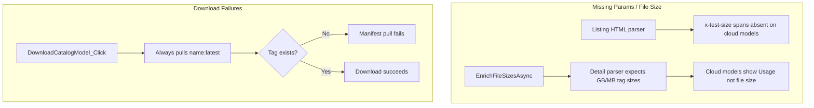

# Fix Model Library: Missing Metadata, Download Errors, Stop Button, Test/Download Mutex

## Investigation summary

### Diagnostic log findings

`%USERPROFILE%\.ollama-amd-vulkan\toolkit-diagnostics.log` and `gui-ai-activity.log` show:

| Pattern | Meaning |
|---------|---------|
| `[Download] pulling manifest` with no `success` | Pull fails or hangs at manifest resolution |
| `Unable to read data from the transport connection: forcibly closed` | Ollama API connection dropped during concurrent pull + benchmark |
| `The calling thread cannot access this object because a different thread owns it` | WPF UI updated from WorkQueue thread during download/catalog ops |

Recent download attempts at 02:41–02:42 show **manifest pull only** (no layer progress, no success) — consistent with an **invalid pull tag**, not a network timeout.

### Catalog data

In `library-catalog-store.json` (234 models):

- **18 models** have `fileSize: "-"` (mostly undownloaded)
- **28 models** have `parameterSize: "-"`

Affected models are predominantly **newer cloud-only libraries** (e.g. `glm-5`, `minimax-m2.5`, `deepseek-v3.2`, `kimi-k2.5`, `gemini-3-flash-preview`) plus a few legacy entries (`openhermes`, `wizardlm`, `cogito` with params but no size).

Verified on ollama.com:

- `glm-5` → only tag: **`glm-5:cloud`** (no `:latest`)
- `minimax-m2.5` → only tag: **`minimax-m2.5:cloud`**
- `deepseek-v3.2` → only tag: **`deepseek-v3.2:cloud`**
- `llama3.2` → has `llama3.2:latest`, `llama3.2:3b`, etc. (works with current code)

### Root causes



1. **Metadata parsers are outdated** for ollama.com's cloud-model layout (`OllamaLibraryHtmlParser`, `OllamaLibraryDetailParser`).
2. **Pull tag is hardcoded** as `{libraryName}:latest` in `DownloadCatalogModel_Click`, undownload test queue, and AI recommendations — wrong for cloud-only models.
3. **No pre-pull validation** — app does not resolve available tags before calling `PullAsync`.
4. **Secondary**: cross-thread UI exceptions corrupt error reporting; concurrent benchmark + download causes connection resets.

---

## Implementation plan

### PR 1 — Catalog tag resolver + metadata enrichment

**New files:**
- `OllamaToolkit.ModelCatalog/OllamaLibraryTagsParser.cs` — parse `/library/{name}/tags` HTML
- `OllamaToolkit.ModelCatalog/CatalogPullTagResolver.cs` — choose best pull tag per library

**Extend `LibraryCatalogEntry`** (`CatalogModels.cs`):
```csharp
public string DefaultPullTag { get; set; } = "";      // e.g. "glm-5:cloud"
public bool IsCloudOnly { get; set; }                 // true when no local-weight tags
```

**`OllamaLibraryTagsParser`** should extract per tag:
- Full tag name (`glm-5:cloud`, `llama3.2:3b`)
- File size when present (`2.0GB`, `581MB`) — skip "High Usage" / "Medium Usage"
- Parameter hint from tag name (`3b`, `7b`, `latest`)
- Whether tag is `cloud`

**`CatalogPullTagResolver.Resolve(libraryName, tags)`** priority:
1. Tag named `latest` (if local size present)
2. Smallest local tag by parsed bytes (for undownload test ordering)
3. Sole available tag (including `:cloud`)
4. Fallback: `{libraryName}:latest` with `Resolved = false`

**Extend `LibraryCatalogStoreService`:**
- `EnrichTagsAndMetadataAsync()` — for entries missing params/size OR missing `DefaultPullTag`:
  - Fetch `https://ollama.com/library/{name}/tags`
  - Parse tags; set `ParameterSize`, `FileSize`, `DefaultPullTag`, `IsCloudOnly`
  - Persist incrementally (same pattern as `EnrichFileSizesAsync`)
- Call from **Refresh Catalog** and **Refresh Descriptions** completion paths
- Optional: background lazy enrichment when Model Library tab loads (rate-limited)

**Extend `OllamaLibraryHtmlParser`** (listing page):
- Parse param count from description regex (`(\d+)B total parameters`, `(\d+)B parameters`)
- Detect `cloud` capability badge → set `IsCloudOnly` hint

**Grid display** (`ModelRegistryService.GetCatalogRowsAsync`):
- Show `DefaultPullTag` suffix in status/tooltip when not `:latest`
- Show `Cloud` badge or muted file size `— (cloud)` for cloud-only models

---

### PR 2 — Fix download flow + error messages

**`MainWindow.xaml.cs` — `DownloadCatalogModel_Click`:**

1. Before pull, resolve tag:
   ```csharp
   var pullTag = await _svc.CatalogPull.ResolvePullTagAsync(row.Name, ct);
   ```
2. If unresolved → MessageBox: *"{name} has no downloadable tag on ollama.com. Try Refresh Catalog."*
3. If `IsCloudOnly` → confirm dialog: *"{pullTag} is a cloud model (runs via Ollama cloud, not a local weight download). Continue?"*
4. Use `pullTag` instead of `$"{row.Name}:latest"` for `PullAsync` and `IsModelInstalledAsync`
5. Log pull tag to diagnostics: `[Catalog] Download started: {pullTag}`
6. Surface raw Ollama `chunk.Error` messages (e.g. "file does not exist") without AI paraphrase

**Apply same resolver** in:
- `RunUndownloadTestQueueAsync` (`UndownloadTestCandidate.PullTag`)
- `ModelRegistryService.GetUndownloadTestQueueAsync`
- `DownloadModelTagFromAiSettingsAsync` / `AiLlmRecommendationService`

**Multi-select download (optional enhancement):**
- `DownloadCatalogModel_Click` currently uses `SelectedItem` only
- With Ctrl/Shift selection, queue downloads for all `CatalogGrid.SelectedItems` sequentially (one at a time, same CTS for stop)

---

### PR 3 — Stop Download button (red when active)

**`MainWindow.xaml`** — same row as Download Selected LLM (~line 157):
```xml
<Button x:Name="CatalogStopDownloadBtn" Content="Stop Download"
        Style="{StaticResource ToolkitButton}" Margin="0,0,4,0"
        Click="CatalogStopDownload_Click" />
```

**`MainWindow.xaml.cs`:**
- `UpdateCatalogDownloadButtonUi()` — mirror `UpdateCatalogStopButtonUi`:
  - When `_catalogDownloadInProgress`: accent/red background (reuse `Brush.Accent`)
  - When idle: default button brush
- Call from download start (`BeginCatalogDownloadProgressUi`) and end (`finally` / cancel)
- `CatalogStopDownload_Click`:
  - If not downloading → no-op or disabled state
  - `_catalogDownloadCts?.Cancel()`
  - Status: *"Stopping download…"*
  - Diagnostics: `[Catalog] STOP download requested`

**Selection hint** — add after CTRL note:
```xml
<TextBlock Text="Hold Shift to select a range of LLMs" Margin="8,0,0,0" ... />
```

---

### PR 4 — Mutual exclusion: download ↔ tests/launch

**Central helpers** in `MainWindow.xaml.cs`:
```csharp
private bool IsCatalogDownloadActive => _catalogDownloadInProgress;

private bool TryBlockIfDownloadActive(string operationName) { ... }
private bool TryBlockDownloadIfTestActive() { ... }
```

**Block tests/launch when download active** — call `TryBlockIfDownloadActive` at start of:
- `TestSelected_Click`
- `TestUntested_Click` (Test Local Untested)
- `TestUndownload_Click`
- `LaunchBestMode_Click`
- `LaunchFromResults_Click`
- `AskAiModels_Click` / `AskAiRun_Click` (uses Ollama inference)
- `CompareCatalog_Click` (if it calls Ollama)

Message: *"A Model Library download is in progress. Click Stop Download or wait for it to finish."*

**Block download when test active** — call `TryBlockDownloadIfTestActive` at start of:
- `DownloadCatalogModel_Click`
- `RunUndownloadTestQueueAsync` inner pull steps (already has test lock; also block reverse)

Use existing `IsBenchmarkQueueRunning()` (`_benchmarkQueueRunning || _activeTestWork`).

Message: *"A benchmark test is running. Click Stop Test before downloading models."*

**Optional**: disable test/launch buttons in UI while `_catalogDownloadInProgress` (same pattern as `SetAiSettingsButtonsEnabled`).

---

### PR 5 — UI threading hardening (download path)

Fix remaining cross-thread issues that cause misleading errors during download:

1. `BeginCatalogDownloadProgressUi` / `ShowCatalogDownloadProgress` — only called via `UiDispatcher.InvokeAsync` (already mostly done; audit all callers)
2. `UpdateCatalogDownloadButtonUi` — always on UI thread
3. `ExplainErrorAsync` — skip AI paraphrase for WPF threading + Ollama pull errors

*(Overlaps with prior Categorize All threading plan — implement together.)*

---

### PR 6 — Verify, build, publish

**Manual test matrix:**

| Scenario | Expected |
|----------|----------|
| `glm-5` (cloud-only, no params/size) | After Refresh Catalog: params from description, tag `glm-5:cloud`, cloud badge |
| Download `glm-5` | Confirm cloud dialog → pull `glm-5:cloud` → success or clear Ollama error |
| Download `llama3.2` | Pull `llama3.2:latest` (or smallest tag), params/size populated |
| Stop Download mid-pull | Red button cancels; row highlight clears; status shows cancelled |
| Download while test running | Blocked with message |
| Test while download running | Blocked with message |
| Shift+click range in grid | Multiple rows selected |
| Ctrl+click | Multi-select still works |

```powershell
dotnet build OllamaToolkit.sln -c Release
.\scripts\Publish-OllamaToolkitApp.ps1
```

Commit on `csharp-wpf-greenfield`; update `DEVELOPMENT-ARCHIVE-SESSION.log`.

---

## Key code references

Hardcoded `:latest` pull (bug):

```3692:3692:C:\Users\lewis\Ollama-AMD-Vulkan\src\OllamaToolkit.App\MainWindow.xaml.cs
        var model = $"{row.Name}:latest";
```

File size enrichment skips cloud models:

```229:235:C:\Users\lewis\Ollama-AMD-Vulkan\src\OllamaToolkit.ModelCatalog\LibraryCatalogStoreService.cs
                var size = OllamaLibraryDetailParser.ParseFileSizeRange(html);
                if (size != "-" && !string.IsNullOrWhiteSpace(size))
                {
                    entry.FileSize = size;
```

Listing parser param extraction gap:

```53:65:C:\Users\lewis\Ollama-AMD-Vulkan\src\OllamaToolkit.ModelCatalog\OllamaLibraryHtmlParser.cs
                if (kind.Equals("size", StringComparison.OrdinalIgnoreCase))
                {
                    if (FileSizeToken().IsMatch(tag))
                    // ... only x-test-size spans; cloud models lack these
```

Download cancel token already exists:

```3689:3691:C:\Users\lewis\Ollama-AMD-Vulkan\src\OllamaToolkit.App\MainWindow.xaml.cs
        _catalogDownloadCts?.Cancel();
        _catalogDownloadCts = new CancellationTokenSource();
        var ct = _catalogDownloadCts.Token;
```

---

## Todos

- [ ] **pr1-tag-resolver** — Tags parser, pull tag resolver, enrich metadata on refresh
- [ ] **pr2-download-fix** — Use resolved pull tag, cloud confirm, better errors, multi-path resolver
- [ ] **pr3-stop-download-ui** — Stop Download button (red when active), Shift selection hint
- [ ] **pr4-mutex** — Block tests/launch during download; block download during tests
- [ ] **pr5-threading** — UI-thread marshaling for download button state + progress
- [ ] **pr6-verify** — Manual test matrix, build, publish, archive log